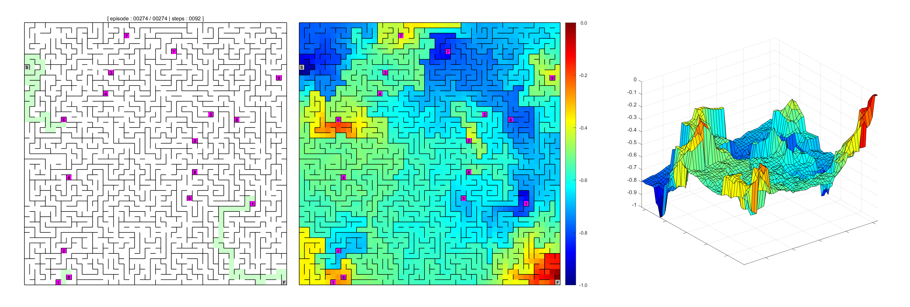

# MazeLearning

Reinforcement Learning algorithm (Q-Learing) that solves simple mazes with teleportation locations.



## About

The MazeLearning algorithm focuses on a computational approach to learning from interaction with the maze environment. The goal is to learn what to do through taking actions and receiving rewards. This process is called reinforcement learning.

The agent interacts with the environment and it provides a reward relative to the state the agent finds itself in. Thus within Reinforcement Learning (RL) an attempt is made to create an agent that is able to read the environment and assess the obtained rewards with the intend to always seek it's maximum. 

The agent is able to stochastically take actions and at some point follows an evolving policy. By taking these semi-randomized actions, learning of the environment occurs by updating the action-values as a function of the current state, the next available state that has the maximum value and some predetermined reward relative to next state, i.e. Q-Learning. This process is described by [Sutton & Barto](https://mitpress.mit.edu/books/reinforcement-learning) (Chapter 6) and exploits the well known Bellman equation for action-values. Q-Learning aims at recursively converging to a policy that provides the agent at some point with an optimal policy that is always moving towards the highest reward.

To setup a proper learning algorithm, the first thing that must be done is the creation of an environment that the agent is capable of reading and thus can navigate. A simple maze environment is therefor constructed as a multilayer cell array in MATLAB. To make things interesting, the maze is equipped with an predetermined amount of bidirectional teleportation pairs. Furthermore the possibility is added to remove a given set of randomly selected walls providing the agent with more navigation options. 

The second step revolves around the actual agent itself and it is able to learn this environment by finding it's way to the finish by making use of these teleportation-location pairs along the way. First through exploration and finally using of the learned optimal policy by exploitation.

The [runme_animated_learning_progression.m](runme_animated_learning_progression.m) MATLAB script fille can be run to get a quick impression of the final result showing an animated progression towards the optimal policy. Running this script displays the agent learning a 14-by-14 maze per episode up to the final solution by making use of four teleportation-location pairs.

## Getting Started

Make sure to have all code stored in a single arbitrary directory, there are no dependencies other than the provided script files. Be sure to create a '..\save' directory for storing learned results.

```
excute runme.m
```

## Built and Run With

* [MATLAB](https://www.mathworks.com/programs/trials/trial_request.html?ref=ggl&s_eid=ppc_5852767522&q=%2Bmathworks%20%2Bmatlab) -  Multi-paradigm numerical computing environment and fourth-generation programming language.

## Author

* **Peter C. Luteijn** - *All code written* - [pcluteijn](https://github.com/pcluteijn)

## License

This project is licensed under the MIT License - see the [LICENSE](LICENSE) file for details
